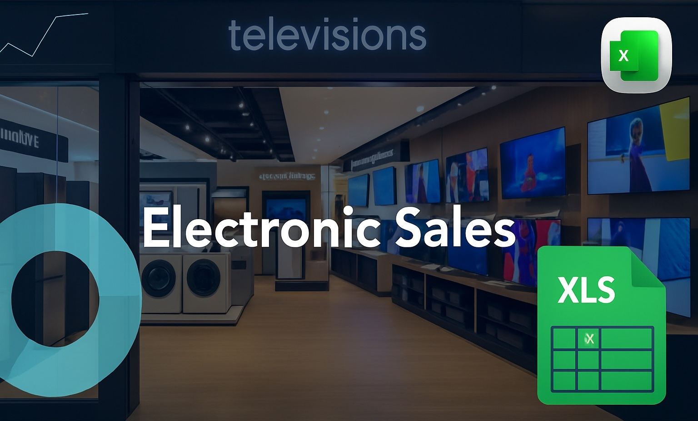

# Excel Project by Yash Yennewar

## 📊 Electronic Sales Analysis Dashboard

This project provides a powerful business dashboard developed in Microsoft Excel to analyze electronic product sales data. It highlights performance metrics across various product categories, time periods, customer segments, and geographic regions, with the goal of supporting data-driven decision-making for a retail business.

## 🔍 Project Overview

The Electronic Sales Dashboard gives a consolidated view of sales performance across time, geography, and products. It transforms raw transactional data into visual insights using Pivot Tables, Charts, and Excel formulas, enabling quick evaluation of profitability, product trends, and regional sales behavior.

<a href ="Electronic_Sales_Analysis.xlsx">Electronic_Sales_Analysis</a>

---

## 🎯 Analysis Objectives

The core goals of this dashboard are to:
- 📦 Identify top-performing products and sub-categories
- 📅 Track monthly and yearly sales growth
- 🌍 Pinpoint geographic regions (states & cities) with highest revenue
- 💰 Evaluate profit margins and sales quantities
- 👥 Monitor customer behavior and payment preferences

---

## 🛠 Tools Used

- **Microsoft Excel** – Data cleaning, pivot tables, and visual dashboards
- **Charts** – Bar charts, line graphs, and maps for insights
- **Formulas** – SUMIFS, COUNTIFS, VLOOKUP for aggregation

---

## 📌 Key Insights

- 🎮 Printers, Gaming, and Phones generate the highest revenue among sub-categories.
- 📆 Sales spike notably during June and December, suggesting seasonal buying trends.
- 🌆 Florida, Illinois, and New York consistently rank as top-performing states.
- 💳 UPI (Unified Payments Interface) is the most commonly used payment method.
- 🔼 Some product categories have high profit but low volume, indicating premium pricing.

---

## 🖼 Dashboard Visualizations

The dashboard includes multiple visual components designed for intuitive exploration and compelling storytelling:
- **📅 Monthly & Yearly Sales Trends** - Track how revenue and orders fluctuate over different months and years to identify seasonal patterns and sales momentum.
- **🧾 Category-wise Profit Contribution** - Visual breakdown of which product categories and sub-categories are contributing the most to overall profit.
- **🗺️ State-wise Sales Performance** -Geographic distribution of revenue across states to uncover regional strongholds and growth opportunities.
- **📦 Total Quantity Sold by Product** - Identify top-selling products based on quantity to inform inventory planning and product strategy.

---

## 💻 Dashboard Preview

&nbsp;
